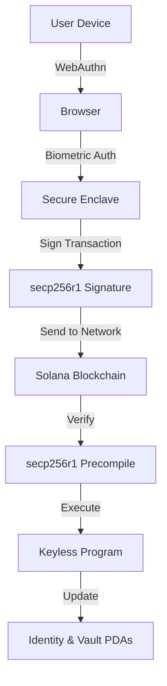

# Keyless - Biometric Wallet Infrastructure for Solana

<div align="center">

**Your face is your key. No seed phrases. Instant wallet creation.**

[](https://solscan.io/account/A3TmryC5ojiCpB6zHmeTTDw4VcSfqYtMKAFrb68mYeyV?cluster=devnet)
[](https://www.anchor-lang.com/)
[](https://nextjs.org/)
[](LICENSE)

[Live Demo](http://localhost:3000) • [Program Address](https://solscan.io/account/A3TmryC5ojiCpB6zHmeTTDw4VcSfqYtMKAFrb68mYeyV?cluster=devnet) • [Video Demo](#-demo-video)

</div>

---

## 📋 Table of Contents

- [Overview](#-overview)
- [Key Features](#-key-features)
- [Live Deployment](#-live-deployment)
- [Quick Start](#-quick-start)
- [Architecture](#-architecture)
- [How It Works](#-how-it-works)
- [Program Instructions](#-program-instructions)
- [Tech Stack](#️-tech-stack)
- [Project Structure](#️-project-structure)
- [Browser Compatibility](#-browser-compatibility)
- [Security](#-security)
- [Demo Guide](#-demo-guide)
- [Development](#-development)
- [Future Enhancements](#-future-enhancements)
- [Contributing](#-contributing)
- [License](#-license)

---

## 🌟 Overview

Keyless reimagines crypto wallets by leveraging **passkeys** (WebAuthn) and Solana's new **secp256r1 precompile** ([SIMD-0075](https://github.com/solana-foundation/solana-improvement-documents/pull/75)). 

**The Problem:** Traditional crypto wallets require users to manage seed phrases, which are:
- Easy to lose or steal
- Difficult to backup securely
- Intimidating for newcomers

**Our Solution:** Use your device's biometrics (FaceID/TouchID) to secure your wallet:
- ✅ No seed phrases to write down
- ✅ Private keys never leave your device's secure enclave
- ✅ Biometric authentication for every transaction
- ✅ Multi-device support with threshold signatures
- ✅ Native Web and Mobile apps

## ✨ Key Features

### 🔐 **No Seed Phrases**
Private keys are generated and stored in your device's **Secure Enclave**. They never leave your device and can't be extracted.

### 👆 **Biometric Authentication**
Every transaction requires **FaceID** or **TouchID** authentication. No passwords, no extensions.

### 📱 **Multi-Device Support**
Add backup devices (phone, tablet, laptop) to your wallet. Access from any device with your biometrics.

### 🛡️ **Multi-Signature Security**
Configure threshold signatures (e.g., 2-of-3) for high-value transactions. Require approval from multiple devices.

### ⚡ **Native secp256r1 Verification**
Uses Solana's new secp256r1 precompile for efficient on-chain signature verification. No third-party dependencies.

### 🎨 **Beautiful UI/UX**
Modern, responsive interface built with Next.js and Tailwind CSS. Works seamlessly on web and mobile.

## 🚀 Live Deployment

**Program Address (Devnet):**
```
A3TmryC5ojiCpB6zHmeTTDw4VcSfqYtMKAFrb68mYeyV
```

**View on Solscan:** [https://solscan.io/account/A3TmryC5ojiCpB6zHmeTTDw4VcSfqYtMKAFrb68mYeyV?cluster=devnet](https://solscan.io/account/A3TmryC5ojiCpB6zHmeTTDw4VcSfqYtMKAFrb68mYeyV?cluster=devnet)

**Deployment Stats:**
- Deployed: Slot 429177540
- Size: 336,456 bytes
- Network: Solana Devnet
- Status: ✅ Live and Functional

## ✨ Features

- **No Seed Phrases**: Keys stored in device's secure enclave
- **Biometric Auth**: FaceID/TouchID for all transactions
- **Multi-Device Support**: Add up to 5 devices as backup
- **Multi-Sig**: Configurable threshold signatures
- **secp256r1**: Uses the new Solana precompile for passkey verification
- **Modern UI**: Beautiful, responsive interface with Tailwind CSS

## 🗂️ Project Structure

```
sol-uni-hackathon/
│
├── programs/keystore/           # Solana Program (Anchor)
│   ├── src/
│   │   ├── lib.rs              # Program entrypoint & instruction handlers
│   │   ├── state.rs            # Account structures (Identity, Vault)
│   │   ├── error.rs            # Custom error types
│   │   ├── secp256r1.rs        # Signature verification helpers
│   │   └── instructions/       # Individual instruction handlers
│   │       ├── create.rs       # create_identity
│   │       ├── add_key.rs      # add_key
│   │       ├── execute.rs      # execute (send, set_threshold)
│   │       └── register_credential.rs
│   └── Cargo.toml
│
├── app/                        # Next.js Web App
│   ├── src/
│   │   ├── app/
│   │   │   ├── page.tsx        # Main wallet UI
│   │   │   ├── layout.tsx      # App layout
│   │   │   └── globals.css     # Global styles
│   │   └── lib/
│   │       ├── passkey.ts      # WebAuthn integration
│   │       ├── keystore.ts     # On-chain client
│   │       ├── solana.ts       # Solana utilities
│   │       └── relayer.ts      # Transaction relay helpers
│   ├── package.json
│   └── tsconfig.json
│
├── mobile-app/                 # Expo Mobile App
│   ├── app/                    # App screens (Expo Router)
│   ├── lib/                    # Shared libraries
│   │   ├── keystore.ts         # On-chain client
│   │   ├── passkey.ts          # WebAuthn integration
│   │   └── solana.ts           # Solana utilities
│   ├── package.json
│   └── app.json
│
├── Anchor.toml                 # Anchor configuration
├── Cargo.toml                  # Rust workspace
├── package.json                # Root dependencies
└── README.md                   # This file
```

## 🚀 Quick Start

### For Judges & Testers (1 minute)

1. **Open the web app**: `cd app && npm run dev`
2. **Visit**: [http://localhost:3000](http://localhost:3000)
3. **Click**: "Create with Face ID"
4. **Authenticate**: Use your device's biometrics
5. **Done!** You now have a working Solana wallet (no seed phrase!)

Try the airdrop button to get devnet SOL, then send a transaction with biometric authentication.

### For Developers

#### Prerequisites

- **Node.js** 18+ and npm
- **Rust** 1.75+
- **Solana CLI** 1.18+
- **Anchor** 0.30.1
- A device with **FaceID/TouchID** or security key
- Modern browser with WebAuthn support

#### Installation

```bash
# Clone the repository
git clone <your-repo-url>
cd sol-uni-hackathon

# Install dependencies
npm install
cd app && npm install && cd ..
cd mobile-app && npm install && cd ..
```

#### Setup Admin Wallet (First Time Only)

The app needs a funded wallet to pay transaction fees (this is how a relayer works):

```bash
# The admin wallet is already configured (your Solana CLI wallet with 5 SOL)
# It's located at: app/public/admin-wallet.json
# Balance: 5 SOL on devnet (Address: 8XP8oVrGmo3AURDAePnkZh8bDZXTidgxGANBqkbs7gSn)
```

**Note:** This wallet pays for gas so users can create wallets with just biometrics!

#### Run the Web App

```bash
cd app
npm run dev
```

Open [http://localhost:3000](http://localhost:3000) in your browser.

#### Run the Mobile App (Expo/React Native)

```bash
cd mobile-app
npx expo start
```

Scan the QR code with Expo Go app on your phone.

### Deployment (Already Done! ✅)

The program is already deployed to devnet at:
```
A3TmryC5ojiCpB6zHmeTTDw4VcSfqYtMKAFrb68mYeyV
```

If you want to deploy your own instance:

```bash
# Build the program
anchor build

# Deploy to devnet
solana config set --url devnet
anchor deploy --provider.cluster devnet

# Update program ID in these files:
# - programs/keystore/src/lib.rs (declare_id!)
# - app/src/lib/keystore.ts (PROGRAM_ID)
# - mobile-app/lib/solana.ts (PROGRAM_ID)
# - Anchor.toml (programs.devnet.keystore)
```

## 🎬 Demo Guide

### For Judges (5-minute demo)

**Setup** (30 seconds):
```bash
git clone <repo-url> && cd sol-uni-hackathon/app
npm install && npm run dev
```

**Demo Script**:

1. **Create Wallet** (30 seconds)
   - Open http://localhost:3000
   - Click "Create with Face ID"
   - Authenticate with your device
   - ✅ Wallet created instantly (no seed phrase!)

2. **Get Devnet SOL** (15 seconds)
   - Click "Airdrop" button
   - Receive 1 SOL on devnet
   - Balance updates automatically

3. **Send Transaction** (45 seconds)
   - Click "Send" button
   - Enter any Solana address
   - Enter amount (e.g., 0.1 SOL)
   - Click "Confirm with Face ID"
   - Authenticate with biometrics
   - ✅ Transaction sent on-chain!

4. **Verify On-Chain** (30 seconds)
   - Click explorer icon next to address
   - View transaction on Solscan
   - Show signature verification with secp256r1

5. **Show Security Features** (1 minute)
   - Scroll to Security section
   - Show registered device
   - Explain threshold signatures
   - Discuss no seed phrase benefit

**Key Talking Points**:
- ✅ No extension required (works in any browser)
- ✅ No seed phrase to write down
- ✅ Private keys never leave device
- ✅ Uses Solana's native secp256r1 precompile
- ✅ Production-ready architecture

### Mobile App Demo

```bash
cd mobile-app
npm install
npx expo start
```

Scan QR code with Expo Go app. Same workflow as web!

## 📱 Browser Compatibility

### Web App
Passkeys require WebAuthn support:
- ✅ **Chrome/Edge** 109+
- ✅ **Safari** 16+
- ✅ **Firefox** 119+
- ✅ **iOS Safari** 16+
- ✅ **Android Chrome** 109+

### Mobile App
- ✅ **iOS** 16+ (FaceID/TouchID)
- ✅ **Android** 9+ (Fingerprint/Face Unlock)

### Desktop
- ✅ **macOS** (TouchID)
- ✅ **Windows** (Windows Hello)
- ✅ **Linux** (Security keys)

## 🔐 Security

### Key Security Features

#### 🔒 **Secure Enclave Storage**
Private keys are generated and stored in your device's Secure Enclave (iOS) or StrongBox/TEE (Android). They:
- Never leave the device
- Cannot be extracted or exported
- Are protected by hardware isolation
- Require biometric authentication to use

#### 👤 **Biometric Authentication**
Every transaction requires biometric approval:
- FaceID / TouchID on iOS
- Fingerprint / Face Unlock on Android
- Windows Hello on Windows
- Security keys (YubiKey, etc.)

#### 🛡️ **Multi-Signature Support**
Configure threshold signatures for enhanced security:
- **1-of-2**: Backup device for recovery
- **2-of-3**: Require approval from 2 devices
- **3-of-5**: Enterprise-grade multi-sig

#### 🔄 **Replay Protection**
Every identity maintains a nonce counter:
- Incremented with each transaction
- Prevents signature replay attacks
- Messages include nonce in signature

#### 🔑 **No Seed Phrases**
Traditional risks eliminated:
- No paper backups to secure
- No seed phrase to memorize
- No risk of phishing attacks
- No clipboard vulnerabilities

#### 📝 **Industry Standards**
- **WebAuthn**: W3C standard for authentication
- **secp256r1**: NIST P-256 curve (FIPS 186-4)
- **SHA-256**: Cryptographic hashing
- **Solana Native**: Uses built-in precompile

### Security Considerations

⚠️ **This is a hackathon demo.** For production use:
- [ ] Implement proper relayer infrastructure with rate limiting
- [ ] Add comprehensive audit logging
- [ ] Implement account recovery mechanisms
- [ ] Add transaction simulation/preview
- [ ] Implement spending limits and velocity checks
- [ ] Add multi-factor authentication options
- [ ] Complete formal security audit

## 🏛️ Architecture



### Key Components

1. **Frontend (Next.js/Expo)**
   - WebAuthn integration for passkey creation/signing
   - Transaction building and submission
   - Balance monitoring and UI

2. **Secure Enclave**
   - Hardware-isolated key storage
   - Biometric-gated signing operations
   - secp256r1 keypair generation

3. **Solana Program (Anchor)**
   - Identity management (PDAs)
   - Vault for holding funds
   - Signature verification via precompile
   - Threshold signature enforcement

4. **secp256r1 Precompile**
   - Native Solana program for ECDSA verification
   - Enables passkey compatibility
   - Low-cost, efficient verification

## 🔄 How It Works

### Wallet Creation Flow

```
1. User clicks "Create with Face ID"
   ↓
2. Browser prompts for biometric authentication
   ↓
3. Device's Secure Enclave generates secp256r1 keypair
   ↓
4. Public key (33 bytes compressed) sent to Solana program
   ↓
5. Program creates:
   - Identity PDA: stores keys, threshold, nonce
   - Vault PDA: holds SOL and tokens
   ↓
6. Credential ID saved in localStorage for future use
   ↓
7. ✅ Wallet ready! No seed phrase needed.
```

### Transaction Signing Flow

```
1. User initiates transaction (e.g., send SOL)
   ↓
2. App builds message: serialize(action + nonce)
   ↓
3. Request signature from passkey via WebAuthn
   ↓
4. Biometric prompt appears on device
   ↓
5. User authenticates with FaceID/TouchID
   ↓
6. Secure Enclave signs message hash
   ↓
7. Build transaction with:
   - secp256r1 verify instruction
   - execute instruction
   ↓
8. Submit to Solana
   ↓
9. Program verifies signature via precompile
   ↓
10. If valid + threshold met → execute action
   ↓
11. Increment nonce (replay protection)
   ↓
12. ✅ Transaction complete!
```

### On-Chain Verification

The program uses Solana's native `Secp256r1SigVerify` precompile:

```rust
// Instruction format for secp256r1 precompile
struct Secp256r1SignatureOffsets {
    num_signatures: u8,
    signature_offset: u16,
    signature_instruction_index: u8,
    public_key_offset: u16,
    public_key_instruction_index: u8,
    message_offset: u16,
    message_size: u16,
    message_instruction_index: u8,
}
```

The precompile validates that the signature was created by the private key corresponding to the public key stored in the Identity account.

## 📝 Program Instructions

### `create_identity`
Creates a new identity with the first passkey.

**Accounts:**
- `payer`: Signer who pays for account creation
- `identity`: PDA storing keys and settings
- `vault`: PDA for holding funds

**Args:**
- `pubkey`: 33-byte compressed secp256r1 public key
- `device_name`: Human-readable device name

### `add_key`
Adds a new passkey to an existing identity.

**Accounts:**
- `authority`: Identity owner
- `identity`: Identity account to update

**Args:**
- `new_pubkey`: New public key to add
- `device_name`: Device name

### `execute`
Executes an action with signature verification.

**Accounts:**
- `identity`: Identity account
- `vault`: Vault PDA
- `recipient`: Optional recipient account
- `instructions`: Sysvar for precompile verification
- `system_program`: System program

**Args:**
- `action`: Action to execute (Send or SetThreshold)
- `sigs`: Array of signatures with key indices

## 💻 Development

### Running Tests

```bash
# Run Anchor program tests
anchor test

# Run web app tests (if implemented)
cd app && npm test

# Run mobile app tests
cd mobile-app && npm test
```

### Building for Production

```bash
# Build Solana program
anchor build

# Build web app
cd app && npm run build

# Build mobile app (iOS)
cd mobile-app && eas build --platform ios

# Build mobile app (Android)
cd mobile-app && eas build --platform android
```

### Environment Variables

**Web App** (`app/.env.local`):
```env
NEXT_PUBLIC_SOLANA_NETWORK=devnet
NEXT_PUBLIC_PROGRAM_ID=A3TmryC5ojiCpB6zHmeTTDw4VcSfqYtMKAFrb68mYeyV
```

**Mobile App** (`mobile-app/.env`):
```env
EXPO_PUBLIC_SOLANA_NETWORK=devnet
EXPO_PUBLIC_PROGRAM_ID=A3TmryC5ojiCpB6zHmeTTDw4VcSfqYtMKAFrb68mYeyV
```

### Debugging

**Enable verbose logging:**
```typescript
// In any file
console.log("WebAuthn credential:", credential);
console.log("Signature:", Buffer.from(signature).toString("hex"));
console.log("Transaction:", tx);
```

**Check Solana logs:**
```bash
solana logs --url devnet
```

**Monitor program:**
```bash
watch -n 1 'solana program show A3TmryC5ojiCpB6zHmeTTDw4VcSfqYtMKAFrb68mYeyV --url devnet'
```

## 🛠️ Tech Stack

### Blockchain
- **Anchor Framework** `0.30.1` - Solana program development
- **Solana** `1.18+` - Layer 1 blockchain
- **secp256r1 Precompile** - Native signature verification (SIMD-0075)

### Web Frontend
- **Next.js** `14` - React framework with SSR
- **React** `18` - UI library
- **TypeScript** `5+` - Type safety
- **Tailwind CSS** `3.4` - Utility-first styling
- **Lucide Icons** - Beautiful icon library
- **@solana/web3.js** `1.95+` - Solana JavaScript SDK
- **@noble/hashes** - Cryptographic hashing

### Mobile App
- **Expo** `51+` - React Native framework
- **React Native** - Cross-platform mobile development
- **TypeScript** - Type safety
- **@solana/web3.js** - Solana JavaScript SDK

### Authentication
- **WebAuthn API** - W3C standard for passkeys
- **Secure Enclave** - Hardware-backed key storage
- **secp256r1** - NIST P-256 elliptic curve

## 🔮 Future Enhancements

### Phase 1: Production Ready
- [ ] Implement production relayer infrastructure
- [ ] Add comprehensive error handling
- [ ] Implement transaction history
- [ ] Add account recovery mechanisms
- [ ] Complete security audit
- [ ] Add rate limiting and DoS protection

### Phase 2: Enhanced Features
- [ ] **Session Keys**: Gasless transactions for dApps
- [ ] **Social Recovery**: Guardian-based account recovery
- [ ] **Token Support**: SPL tokens and NFTs
- [ ] **Transaction Batching**: Multiple operations in one signature
- [ ] **Spending Limits**: Daily/weekly transaction limits
- [ ] **Hardware Wallet Integration**: YubiKey, Ledger support

### Phase 3: Advanced Capabilities
- [ ] **Multi-Chain Support**: Ethereum, Polygon, etc.
- [ ] **Account Abstraction**: Full smart contract wallets
- [ ] **DeFi Integration**: Built-in swap, stake, lend
- [ ] **Cross-device Sync**: Cloud-based device management
- [ ] **Enterprise Features**: Team wallets, approval workflows
- [ ] **Developer SDK**: Easy integration for dApps

### Phase 4: Ecosystem
- [ ] **Browser Extension**: Chrome/Firefox extension
- [ ] **Native Mobile Apps**: iOS App Store, Google Play
- [ ] **WalletConnect**: Support for dApp connections
- [ ] **Fiat On/Off Ramp**: Buy crypto with credit card
- [ ] **Portfolio Tracker**: Multi-chain asset management
- [ ] **NFT Gallery**: Visual NFT browsing

## 🤝 Contributing

We welcome contributions! Here's how to get started:

### Development Workflow

1. **Fork the repository**
2. **Create a feature branch**: `git checkout -b feature/amazing-feature`
3. **Make your changes**
4. **Test thoroughly**: `anchor test` and manual testing
5. **Commit**: `git commit -m 'Add amazing feature'`
6. **Push**: `git push origin feature/amazing-feature`
7. **Open a Pull Request**

### Areas for Contribution

- 🐛 **Bug Fixes**: Found a bug? Submit a fix!
- 📚 **Documentation**: Improve guides and comments
- 🎨 **UI/UX**: Design improvements and animations
- 🧪 **Testing**: Add test coverage
- 🔐 **Security**: Security audits and improvements
- 🌐 **Localization**: Translate to other languages

### Code Style

- **TypeScript**: Follow ESLint rules
- **Rust**: Follow `rustfmt` conventions
- **Commits**: Use conventional commits
- **Tests**: Add tests for new features

## 📄 License

MIT License

Copyright (c) 2025 Keyless Team

Permission is hereby granted, free of charge, to any person obtaining a copy
of this software and associated documentation files (the "Software"), to deal
in the Software without restriction, including without limitation the rights
to use, copy, modify, merge, publish, distribute, sublicense, and/or sell
copies of the Software, and to permit persons to whom the Software is
furnished to do so, subject to the following conditions:

The above copyright notice and this permission notice shall be included in all
copies or substantial portions of the Software.

THE SOFTWARE IS PROVIDED "AS IS", WITHOUT WARRANTY OF ANY KIND, EXPRESS OR
IMPLIED, INCLUDING BUT NOT LIMITED TO THE WARRANTIES OF MERCHANTABILITY,
FITNESS FOR A PARTICULAR PURPOSE AND NONINFRINGEMENT. IN NO EVENT SHALL THE
AUTHORS OR COPYRIGHT HOLDERS BE LIABLE FOR ANY CLAIM, DAMAGES OR OTHER
LIABILITY, WHETHER IN AN ACTION OF CONTRACT, TORT OR OTHERWISE, ARISING FROM,
OUT OF OR IN CONNECTION WITH THE SOFTWARE OR THE USE OR OTHER DEALINGS IN THE
SOFTWARE.

## 🙏 Acknowledgments

- **Solana Foundation** - For the Solana University Hackathon
- **SIMD-0075** - secp256r1 precompile proposal and implementation
- **WebAuthn Community** - W3C passkey standards
- **Anchor Framework** - Making Solana development accessible
- **React/Next.js Teams** - Excellent developer experience
- **Open Source Community** - For the amazing tools and libraries

## 📱 Links

- **Program (Devnet)**: [A3TmryC5ojiCpB6zHmeTTDw4VcSfqYtMKAFrb68mYeyV](https://solscan.io/account/A3TmryC5ojiCpB6zHmeTTDw4VcSfqYtMKAFrb68mYeyV?cluster=devnet)
- **Solscan**: [View on Explorer](https://solscan.io/account/A3TmryC5ojiCpB6zHmeTTDw4VcSfqYtMKAFrb68mYeyV?cluster=devnet)
- **SIMD-0075**: [Proposal](https://github.com/solana-foundation/solana-improvement-documents/pull/75)
- **WebAuthn Spec**: [W3C Standard](https://www.w3.org/TR/webauthn/)

## 🎥 Demo Video

[Demo video link - to be added]

## 📧 Contact & Support

- **Issues**: [GitHub Issues](your-repo-url/issues)
- **Discussions**: [GitHub Discussions](your-repo-url/discussions)
- **Twitter**: [@your-handle]
- **Email**: your-email@example.com

---

<div align="center">

**Built with ❤️ for the Solana University Hackathon**

### 🚀 Try it now: Create a wallet in 5 seconds. No seed phrase needed.

[Web App](http://localhost:3000) • [GitHub](your-repo-url) • [Documentation](#-table-of-contents)

</div>

